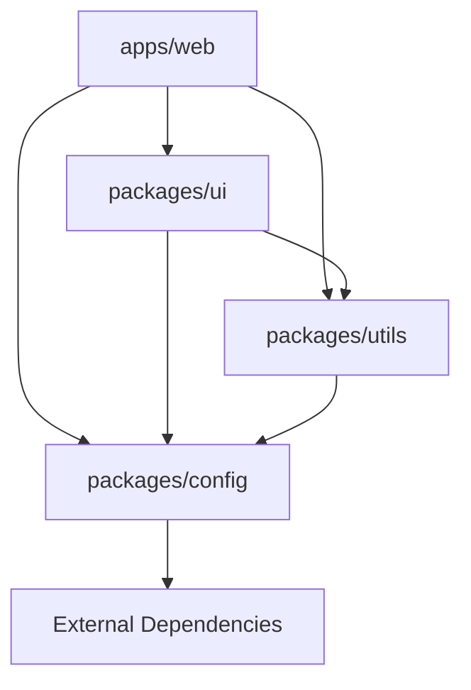
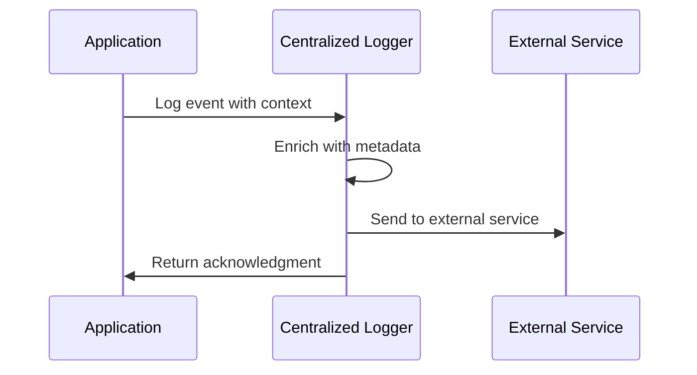
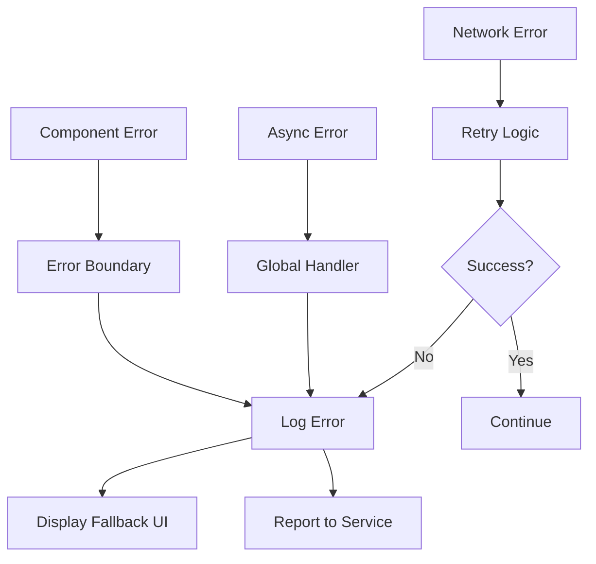
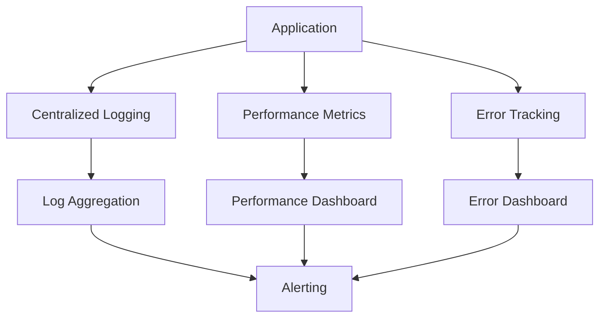

# Architecture Overview

## 🏗️ Monorepo Structure

This enterprise React starter uses a carefully designed monorepo architecture that promotes code reuse, consistency, and scalability across multiple packages and applications.

### High-Level Architecture

```
┌─────────────────────────────────────────────────────────────┐
│                     Enterprise React Starter                │
├─────────────────────────────────────────────────────────────┤
│  apps/                                                      │
│  └── web/              ← Main React Application             │
│      ├── src/                                               │
│      │   ├── components/     ← App-specific components      │
│      │   ├── pages/          ← Route components             │
│      │   ├── hooks/          ← Custom hooks                 │
│      │   └── lib/            ← App utilities               │
│      └── package.json        ← App dependencies            │
├─────────────────────────────────────────────────────────────┤
│  packages/                                                  │
│  ├── config/          ← Shared Configurations              │
│  │   ├── eslint.config.js    ← ESLint rules               │
│  │   ├── tailwind.config.ts  ← Design system              │
│  │   ├── tsconfig.base.json  ← TypeScript config          │
│  │   └── vite.config.base.ts ← Build configuration        │
│  ├── ui/              ← Shared UI Components               │
│  │   ├── src/components/     ← Reusable components        │
│  │   └── src/styles/         ← Component styles           │
│  └── utils/           ← Shared Utilities                   │
│      ├── src/logger.ts       ← Centralized logging        │
│      └── src/validation.ts   ← Input validation           │
├─────────────────────────────────────────────────────────────┤
│  tools/                                                     │
│  └── scripts/         ← Development Tools                   │
│      ├── generators/         ← Code generators             │
│      ├── setup.sh           ← Environment setup           │
│      └── build-analyze.sh   ← Performance analysis        │
└─────────────────────────────────────────────────────────────┘
```

## 📦 Package Dependencies

### Dependency Graph



### Package Responsibilities

| Package | Purpose | Exports |
|---------|---------|---------|
| `@company/config` | Shared configurations | ESLint, Tailwind, TypeScript, Vite configs |
| `@company/ui` | Reusable UI components | Button, Card, Dialog, etc. |
| `@company/utils` | Shared utilities | Logger, validation, helpers |
| `@company/web` | Main application | React app entry point |

## 🔧 Configuration Architecture

### Shared Configuration Strategy

All packages inherit from shared base configurations, ensuring consistency across the monorepo:

```typescript
// packages/config/eslint.config.js
export const createESLintConfig = (options = {}) => {
  return tseslint.config(
    // Enterprise-grade rules
    // Security rules
    // Performance rules
  );
};

// apps/web/eslint.config.js
import { createESLintConfig } from '@company/config/eslint'
export default createESLintConfig()
```

### Configuration Inheritance

```
Base Config (packages/config/)
├── ESLint Rules
│   ├── TypeScript strict rules
│   ├── React best practices
│   ├── Security rules
│   └── Performance rules
├── Tailwind Design System
│   ├── Color tokens
│   ├── Typography scale
│   ├── Spacing system
│   └── Component variants
├── TypeScript Configuration
│   ├── Strict type checking
│   ├── Path aliases
│   ├── Project references
│   └── Build targets
└── Vite Build Configuration
    ├── Development optimizations
    ├── Production optimizations
    ├── Code splitting
    └── Asset handling
```

## 🎨 Design System Architecture

### Token-Based Design System

The design system uses CSS custom properties (tokens) for consistent theming:

```css
/* Design System Tokens */
:root {
  /* Brand Colors */
  --enterprise-primary: 220 91% 48%;
  --enterprise-secondary: 259 84% 60%;
  
  /* Semantic Colors */
  --background: 0 0% 100%;
  --foreground: 222.2 84% 4.9%;
  
  /* Component Tokens */
  --gradient-enterprise: linear-gradient(...);
  --shadow-enterprise: 0 4px 20px hsl(...);
}
```

### Component Variants Architecture

```typescript
// packages/ui/src/components/button.tsx
const buttonVariants = cva(
  "base-button-styles",
  {
    variants: {
      variant: {
        default: "bg-primary text-primary-foreground",
        enterprise: "bg-gradient-enterprise shadow-enterprise",
        outline: "border border-input bg-background",
      },
      size: {
        default: "h-10 px-4 py-2",
        sm: "h-9 px-3",
        lg: "h-11 px-8",
      }
    }
  }
)
```

## 📊 Data Flow Architecture

### Centralized Logging



### Error Handling Flow



## 🔄 Build Architecture

### Multi-Stage Build Process


### Package Build Order

1. **packages/config** - Base configurations
2. **packages/utils** - Shared utilities  
3. **packages/ui** - UI components
4. **apps/web** - Main application

### Build Optimization

- **Tree Shaking**: Remove unused code
- **Code Splitting**: Split bundles by routes and vendors
- **Asset Optimization**: Minify and compress assets
- **Caching**: Aggressive caching strategies

## 🛡️ Security Architecture

### Security Layers

```
┌─────────────────────────────────────────┐
│              Application Layer           │
│  • Input Validation (Zod)              │
│  • XSS Prevention                      │
│  • CSRF Protection                     │
└─────────────────────────────────────────┘
┌─────────────────────────────────────────┐
│              Transport Layer            │
│  • HTTPS Enforcement                   │
│  • Security Headers                    │
│  • Content Security Policy            │
└─────────────────────────────────────────┘
┌─────────────────────────────────────────┐
│              Infrastructure Layer       │
│  • Container Security                  │
│  • Environment Isolation              │
│  • Secrets Management                 │
└─────────────────────────────────────────┘
```

### Security Headers

```nginx
# Security headers in production
add_header X-Frame-Options "SAMEORIGIN" always;
add_header X-Content-Type-Options "nosniff" always;
add_header X-XSS-Protection "1; mode=block" always;
add_header Referrer-Policy "strict-origin-when-cross-origin" always;
add_header Content-Security-Policy "..." always;
```

## 🚀 Deployment Architecture

### Multi-Environment Strategy

```
┌─────────────────┐    ┌─────────────────┐    ┌─────────────────┐
│   Development   │    │     Staging     │    │   Production    │
│                 │    │                 │    │                 │
│ • Hot Reload    │    │ • Production    │    │ • Optimized     │
│ • Debug Mode    │    │   Build         │    │   Build         │
│ • Mock Data     │    │ • Real APIs     │    │ • CDN           │
│ • Dev Tools     │    │ • Error Track   │    │ • Monitoring    │
└─────────────────┘    └─────────────────┘    └─────────────────┘
```

### Container Architecture

```dockerfile
# Multi-stage build
FROM node:22-alpine AS base     # Base environment
FROM base AS deps               # Install dependencies  
FROM deps AS build-packages     # Build shared packages
FROM build-packages AS build-web # Build web app
FROM nginx:alpine AS production # Production server
```

## 📈 Performance Architecture

### Performance Strategies

1. **Bundle Optimization**
   - Code splitting by routes
   - Vendor chunk separation
   - Dynamic imports for large components

2. **Caching Strategy**
   - Static asset caching (1 year)
   - Build artifact caching
   - Browser caching headers

3. **Loading Optimization**
   - Lazy loading for routes
   - Image lazy loading
   - Preloading critical resources

### Monitoring & Observability



## 🔍 Development Experience

### Developer Tools Integration

- **Hot Module Replacement**: Instant feedback during development
- **TypeScript Integration**: Real-time type checking
- **ESLint Integration**: Code quality enforcement
- **Pre-commit Hooks**: Quality gates before commits

### Code Generation

```bash
# Component generation
node tools/scripts/generators/component.js MyComponent
# Creates: packages/ui/src/components/my-component/index.tsx
# Updates: packages/ui/src/components/index.ts

# Page generation  
node tools/scripts/generators/page.js MyPage
# Creates: apps/web/src/pages/MyPage.tsx
# Provides: Route configuration guidance

# Hook generation
node tools/scripts/generators/hook.js myHook
# Creates: apps/web/src/hooks/useMyHook.tsx
# Includes: TypeScript interfaces and error handling
```

## 🧪 Testing Architecture

### Testing Strategy

```
┌─────────────────────────────────────────┐
│                Unit Tests                │
│  • Component logic                      │
│  • Utility functions                    │
│  • Business rules                       │
└─────────────────────────────────────────┘
┌─────────────────────────────────────────┐
│            Integration Tests             │
│  • API interactions                     │
│  • Component integration                │
│  • State management                     │
└─────────────────────────────────────────┘
┌─────────────────────────────────────────┐
│              E2E Tests                   │
│  • User workflows                       │
│  • Critical paths                       │
│  • Cross-browser testing                │
└─────────────────────────────────────────┘
```

## 📚 Documentation Architecture

### Documentation Strategy

- **Architecture Documentation**: This file and related docs
- **API Documentation**: Generated from TypeScript interfaces
- **Component Documentation**: Storybook integration (optional)
- **Development Guide**: Step-by-step instructions
- **Deployment Guide**: Production deployment instructions

---

This architecture provides a solid foundation for building scalable, maintainable enterprise applications while maintaining developer productivity and code quality.